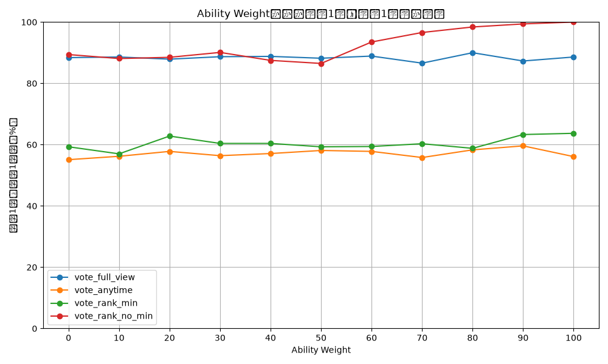
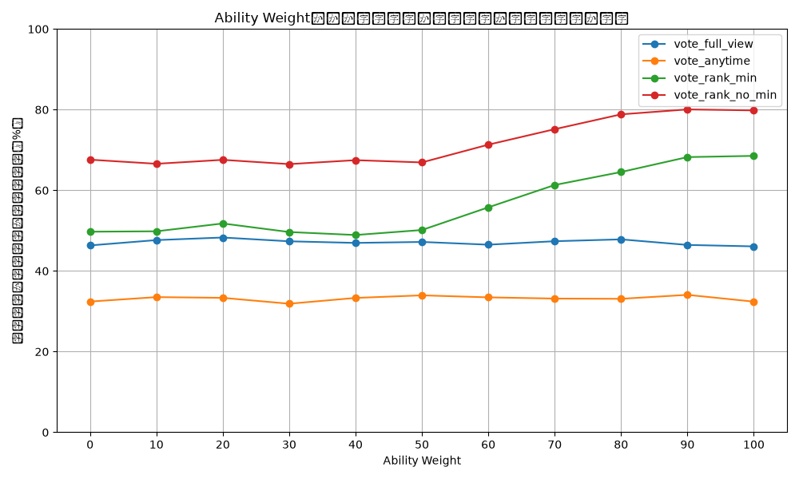
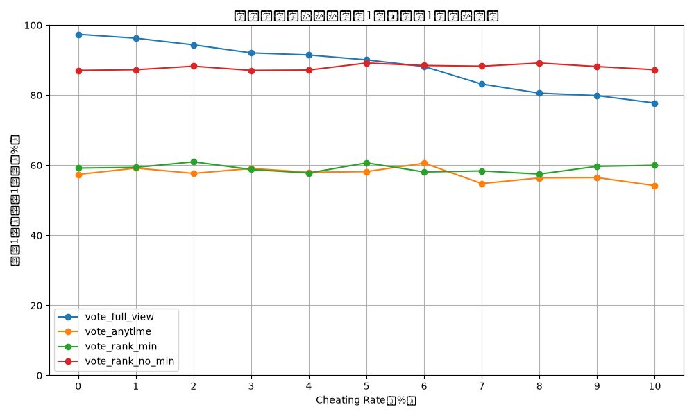
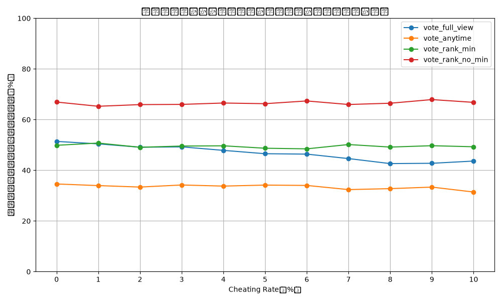

# 学内バンドコンテストの観客投票シミュレーション

## 概要

学内バンドコンテストにおける観客投票をモデル化し、複数の投票方式についてシミュレーションを行う。

本プロジェクトでは、バンドの実力、観客の視聴状況や実力重視度、好きなバンドへの補正、不正投票などをモデル化し、投票方式によって結果がどのように変化するかを比較する。

シミュレーション結果をもとに、実力の高いバンドが適切に評価されるか、不正投票や人気投票の影響をどの程度受けるかを分析し、実際の学内バンドコンテストにおける投票方法を検討するための判断材料とする。


## 背景・目的

数年前から、学内バンドコンテストでは観客投票を行っていた。

一方で、不正投票が発生したことや、観客投票という仕組み上、バンドの実力よりも人気が結果に反映されやすいという問題があった。そのため、演奏を評価した結果として、実力のあるバンドが適切に評価される投票方法を検討する必要があると考えた。

昨年度からは、不正投票の防止や人気投票を避けるための取り組みが行われていた。しかし、実際に投票を行った場合にどのような結果になるのか、不正投票によってどの程度結果が変化するのかについて、十分な検証が行われていなかった。

これまでの投票方法の検討では、「この方法なら問題が起こりにくいだろう」という主観的な予測に基づいて決定される部分があった。

そこで、投票方法をプログラム上でモデル化し、さまざまな条件でシミュレーションを行うことで、それぞれの投票方法が実力や人気、不正投票によってどのような影響を受けるのかを確認することにした。

本シミュレーションは、実際の投票方法を決定するための唯一の根拠ではなく、投票方法について議論する際の判断材料として利用することを目的とする。

なお、現実の観客や投票行動を完全にモデル化することは難しいため、シミュレーション結果が実際の結果を正確に再現するとは限らない。そのため、結果をそのまま採用するのではなく、モデルの限界を考慮した上で利用する。


## シミュレーション内容

### 1. バンドモデル

各バンドについて、以下の情報を設定する。

- バンド名
- 実力値
- 演奏順

実力値は、以下のようなパターンを設定できる。

- ランダム
- 上位のバンドが拮抗
- 下位のバンドが拮抗
- その他、実力差を調整したパターン

今回のシミュレーションでは、5つのバンドを用意し、実力順を以下のように設定する。

| 実力順位 | バンド |
|---:|---|
| 1 | バンドA |
| 2 | バンドB |
| 3 | バンドC |
| 4 | バンドD |
| 5 | バンドE |

演奏順については、シミュレーションごとにランダムに設定する。


### 2. 観客モデル

各観客について、以下の情報を持たせる。

| 項目 | 内容 |
|---|---|
| 観客ID | 観客を識別する通し番号 |
| 見始めたバンド | 何番目のバンドから観覧したか |
| 見終わったバンド | 何番目のバンドまで観覧したか |
| 実力重視度 | バンドの実力をどの程度重視するか |
| 好きなバンド | 観客が好むバンド |
| 好きなバンド補正 | 好きなバンドに対して加える補正 |
| 不正投票 | 不正投票を行う観客かどうか |

観客の評価は、実力を重視する傾向と、好きなバンドを重視する傾向を組み合わせてモデル化する。


### 3. 投票モデル

今回、以下の4種類の投票方式をモデル化する。

#### vote_full_view

全バンドの演奏を見た観客のみが投票できる方式。

全バンドを見ていない観客には投票権を与えない。

#### vote_rank_min

観客が見たバンドに順位をつけ、見ていないバンドには、観客がつけた順位の最低順位を適用する方式。

例えば、3バンドを見た場合、見た3バンドには1位、2位、3位をつけ、見ていないバンドには3位を適用する。

#### vote_rank_no_min

観客が実際に見たバンドのみを順位付けし、見ていないバンドには点数を与えない方式。

その後、各バンドの平均点を計算し、総合順位を決定する。

#### vote_anytime

観客が任意のタイミングで投票できる方式。

途中から観覧した観客や途中で退場した観客も投票できる。

また、再入場した観客が複数回投票できる可能性を不正投票としてモデル化する。


## 不正投票のモデル

投票方式によって発生しうる不正投票を、以下のようにモデル化する。


### vote_full_view

本来は全バンドを見た観客のみが投票できるが、投票資格のない観客が投票するケースを想定する。

また、不正投票を行う観客は、バンドの実力を考慮せず、自分の好きなバンドに投票するものとして実装する。


### vote_rank_min / vote_rank_no_min

投票用紙の運用上、演奏が終了したバンドや、まだ演奏していないバンドに斜線を引くなどの対策を想定する。

また、同率順位が複数存在する投票を無効にするなどの対策を想定する。

本シミュレーションでは、こうした対策によって完全に防止できない不正投票の影響を考慮する。


### vote_anytime

途中退場・再入場した観客を正確に把握することが難しい場合、同じ観客が複数回投票できる可能性がある。

本プログラムでは、不正投票を行う観客がランダムに1～5人分の投票権を持つものとして実装する。


## 評価指標

各投票方式について、シミュレーションを1000回実行し、以下の指標を計算する。

### 1. 1位一致率

実力1位のバンドが、投票結果でも1位になる割合。

```text
1位一致率 =
実力1位のバンドが結果1位になった回数 / シミュレーション回数
```

### 2. 順位一致率

実力順位と投票結果の順位がどの程度一致しているかを表す指標。

実力順位と結果順位の一致度を計算し、シミュレーション全体の平均値を求める。

### 3. 投票率

投票資格を持つ観客のうち、実際に投票した観客の割合。

投票方式によって投票率が異なるため、結果の解釈に使用する。


## 実行方法

以下の流れでシミュレーションを実行する。

```text
バンドモデルの作成
        ↓
観客モデルの作成
        ↓
投票モデルの実行
        ↓
評価指標の計算
        ↓
結果の出力
```

各条件について1000回のシミュレーションを行い、1位一致率、順位一致率などを比較する。

また、観客の実力重視度や不正投票を行う観客の割合を変化させ、それぞれの条件による結果の変化をグラフとして出力する。


## シミュレーション結果

### 実力重視度による比較

観客がどの程度バンドの実力を重視するかを変化させてシミュレーションを行った。

`ability_weight` が大きいほど、観客が実力を重視する割合が高くなる。

### vote_full_view

| ability_weight | 1位一致率 | 順位一致率 |
|---:|---:|---:|
| 0 | 88.40% | 46.34% |
| 10 | 88.60% | 47.66% |
| 20 | 87.90% | 48.30% |
| 30 | 88.70% | 47.36% |
| 40 | 88.80% | 46.96% |
| 50 | 88.20% | 47.20% |
| 60 | 88.90% | 46.52% |
| 70 | 86.60% | 47.38% |
| 80 | 90.00% | 47.84% |
| 90 | 87.30% | 46.46% |
| 100 | 88.60% | 46.10% |

### vote_anytime

| ability_weight | 1位一致率 | 順位一致率 |
|---:|---:|---:|
| 0 | 55.10% | 32.42% |
| 10 | 56.20% | 33.52% |
| 20 | 57.80% | 33.34% |
| 30 | 56.40% | 31.88% |
| 40 | 57.10% | 33.32% |
| 50 | 58.10% | 33.96% |
| 60 | 57.80% | 33.46% |
| 70 | 55.80% | 33.16% |
| 80 | 58.30% | 33.10% |
| 90 | 59.60% | 34.08% |
| 100 | 56.10% | 32.40% |

### vote_rank_min

| ability_weight | 1位一致率 | 順位一致率 |
|---:|---:|---:|
| 0 | 59.30% | 49.74% |
| 10 | 57.00% | 49.84% |
| 20 | 62.80% | 51.78% |
| 30 | 60.40% | 49.66% |
| 40 | 60.40% | 48.92% |
| 50 | 59.30% | 50.16% |
| 60 | 59.40% | 55.78% |
| 70 | 60.30% | 61.32% |
| 80 | 58.80% | 64.54% |
| 90 | 63.30% | 68.24% |
| 100 | 63.70% | 68.54% |

### vote_rank_no_min

| ability_weight | 1位一致率 | 順位一致率 |
|---:|---:|---:|
| 0 | 89.40% | 67.60% |
| 10 | 88.10% | 66.58% |
| 20 | 88.50% | 67.56% |
| 30 | 90.10% | 66.50% |
| 40 | 87.50% | 67.48% |
| 50 | 86.50% | 66.92% |
| 60 | 93.50% | 71.32% |
| 70 | 96.60% | 75.16% |
| 80 | 98.40% | 78.84% |
| 90 | 99.40% | 80.06% |
| 100 | 100.00% | 79.82% |


### 結果グラフ

#### 1位一致率





#### 順位一致率





## 不正投票の影響

不正投票を行う観客の割合を変化させ、各投票方式への影響を確認した。

### vote_full_view

| 不正投票率 | 1位一致率 | 順位一致率 |
|---:|---:|---:|
| 0% | 97.40% | 51.40% |
| 1% | 96.30% | 50.42% |
| 2% | 94.40% | 49.10% |
| 3% | 92.10% | 49.24% |
| 4% | 91.50% | 47.86% |
| 5% | 90.10% | 46.54% |
| 6% | 88.20% | 46.38% |
| 7% | 83.20% | 44.62% |
| 8% | 80.60% | 42.64% |
| 9% | 79.90% | 42.76% |
| 10% | 77.80% | 43.64% |

### vote_anytime

| 不正投票率 | 1位一致率 | 順位一致率 |
|---:|---:|---:|
| 0% | 57.40% | 34.60% |
| 1% | 59.20% | 33.96% |
| 2% | 57.70% | 33.38% |
| 3% | 59.10% | 34.20% |
| 4% | 58.00% | 33.76% |
| 5% | 58.20% | 34.16% |
| 6% | 60.60% | 34.02% |
| 7% | 54.80% | 32.38% |
| 8% | 56.40% | 32.76% |
| 9% | 56.50% | 33.36% |
| 10% | 54.20% | 31.42% |

### vote_rank_min

| 不正投票率 | 1位一致率 | 順位一致率 |
|---:|---:|---:|
| 0% | 59.20% | 49.86% |
| 1% | 59.40% | 50.74% |
| 2% | 61.00% | 49.08% |
| 3% | 58.80% | 49.56% |
| 4% | 57.80% | 49.66% |
| 5% | 60.70% | 48.70% |
| 6% | 58.10% | 48.46% |
| 7% | 58.40% | 50.16% |
| 8% | 57.50% | 49.16% |
| 9% | 59.70% | 49.70% |
| 10% | 60.00% | 49.28% |

### vote_rank_no_min

| 不正投票率 | 1位一致率 | 順位一致率 |
|---:|---:|---:|
| 0% | 87.10% | 66.92% |
| 1% | 87.30% | 65.26% |
| 2% | 88.30% | 65.92% |
| 3% | 87.10% | 66.00% |
| 4% | 87.20% | 66.54% |
| 5% | 89.20% | 66.28% |
| 6% | 88.50% | 67.36% |
| 7% | 88.30% | 65.96% |
| 8% | 89.20% | 66.46% |
| 9% | 88.20% | 67.90% |
| 10% | 87.30% | 66.80% |


### 不正投票の結果グラフ

#### 1位一致率





#### 順位一致率





## 考察

### 実力重視度による変化

`vote_rank_no_min` では、観客の実力重視度が高くなるにつれて、順位一致率が大きく上昇した。

特に `ability_weight=60` 以降では順位一致率の上昇が目立ち、`ability_weight=100` では1位一致率が100.00%、順位一致率が79.82%となった。

一方、`vote_full_view` や `vote_anytime` では、実力重視度を変化させても結果が大きく変化しなかった。

このことから、投票者が実力を重視するだけでなく、その評価を投票結果に反映しやすい投票方式になっているかどうかも重要であると考えられる。

### 投票率と不正投票の影響

`vote_full_view` は全バンドを見た観客だけが投票できるため、投票できる観客数が少なくなりやすい。

今回のモデルでは、投票数が少ない条件では一部の不正投票が結果全体に与える影響が大きくなった。

実際に、`vote_full_view` では不正投票率が0%のときの1位一致率が97.40%だったのに対し、不正投票率10%では77.80%まで低下した。

一方、`vote_rank_no_min` では不正投票率を0～10%に変化させても、1位一致率と順位一致率に大きな変化は見られなかった。

ただし、これは今回設定した不正投票モデルの範囲での結果であり、実際の不正投票に対して同様の結果になるとは限らない。


## 結果から分かること

今回のシミュレーションでは、投票方式によって、実力重視度や不正投票が結果に与える影響が大きく異なることが確認できた。

また、単純に「実力を重視する観客を増やせば実力順に近づく」とは限らず、観客が持つ評価をどのように投票結果へ反映させるかが重要であることが分かった。

一方で、今回のシミュレーションには、観客の行動や人気度、不正投票などについて仮定を置いている部分がある。

そのため、今回の結果だけから実際の投票方式の優劣を断定することはできない。


## プロジェクト構成

```text
Voting-Simulation/
├── .vscode/
│   └── settings.json
├── results/
├── src/
│   ├── __pycache__/
│   ├── audience_model.py
│   ├── band_model.py
│   ├── main.py
│   ├── plot_simulation.py
│   ├── simulation_rank.py
│   ├── simulation.py
│   ├── vote_advisor.py
│   ├── vote_anytime.py
│   ├── vote_full_view.py
│   ├── vote_rank.py
│   └── voting_model.py
├── .gitignore
└── README.md
```

※実際のファイル構成に合わせて変更する。


## 今後の展望

今後は、実際の学内バンドコンテストで発生しうる状況をより正確に再現できるよう、モデルの改善を行う。

具体的には、以下のような項目を検討する。

- 実際の観客数に近い条件でのシミュレーション
- 観客の途中入場・途中退場のモデルの改善
- バンドごとの人気度の導入
- 複数人による組織的な不正投票のモデル化
- 投票方式ごとの無効票の発生
- 同点になった場合の処理
- 観客の評価のばらつきの改善
- 実際の過去の投票結果との比較

モデルを改善し、より現実に近い条件で検証することで、実際の投票方法を検討する際に、より有用な判断材料となることを目指す。


## 注意事項

本シミュレーションは、実際の観客の行動や投票結果を完全に再現するものではない。

シミュレーション結果は、設定したモデルと条件に基づく結果であるため、実際の投票方法を決定する際には、シミュレーション結果だけで判断せず、運用上の負担、不正防止のしやすさ、参加者への公平性なども含めて総合的に検討する必要がある。
